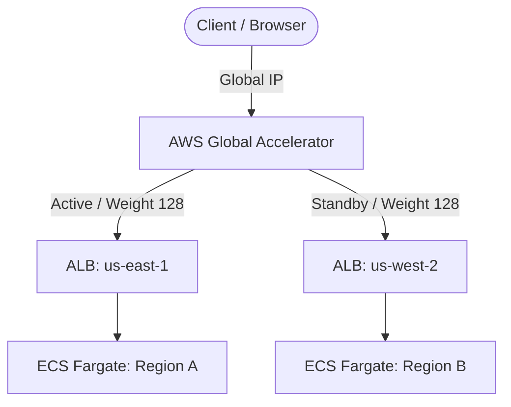

# Multi-Region AWS Infrastructure with Global Accelerator & ECS

This project provisions a resilient, multi-region architecture using Terraform and GitHub Actions, deploying an Amazon ECS Fargate application across two AWS regions (`us-east-1` and `us-west-2`) fronted by an AWS Global Accelerator.

## Architecture & Workflow Diagram

Infrastructure Provisioning & Teardown via GitHub Actions
1. Creation (apply.yml)
To provision the entire multi-region stack through automated pipelines:

Push your changes or manually trigger the GitHub Actions workflow to initialize the S3 backend and apply your Terraform configuration, building all networking, load balancing, compute, and Global Accelerator components.

2. Destruction (destroy.yml)
To tear down the resources cleanly via GitHub Actions:

Trigger the destroy workflow. It executes terraform destroy (incorporating state exemption handling for shared IAM/GitHub Actions roles) to ensure a complete teardown of all resources without leaving orphaned items or incurring lingering costs.

Multi-Region Failover Testing Guide
To verify that the Global Accelerator correctly handles regional outages and routes traffic seamlessly:

Access the Application: Open your browser or run a curl command using your Global Accelerator DNS output to confirm traffic is loading successfully:

curl -I http://<YOUR_ACCELERATOR_DNS>

Simulate a Region A Outage: Scale down the ECS tasks in Region A to zero to force a health check failure:

aws ecs update-service --cluster prod-us-east-1-cluster --service app-service --desired-count 0 --region us-east-1
Verify Failover:

Check the AWS Global Accelerator console under your listener's endpoint groups to observe Region A transition to an Unhealthy state (1 Unhealthy endpoints).

Refresh your browser or curl endpoint; traffic will automatically reroute to Region B with a successful 200 OK response.

Restore Normal Operation: Scale your Region A tasks back up to restore traffic distribution:

aws ecs update-service --cluster prod-us-east-1-cluster --service app-service --desired-count 1 --region us-east-1