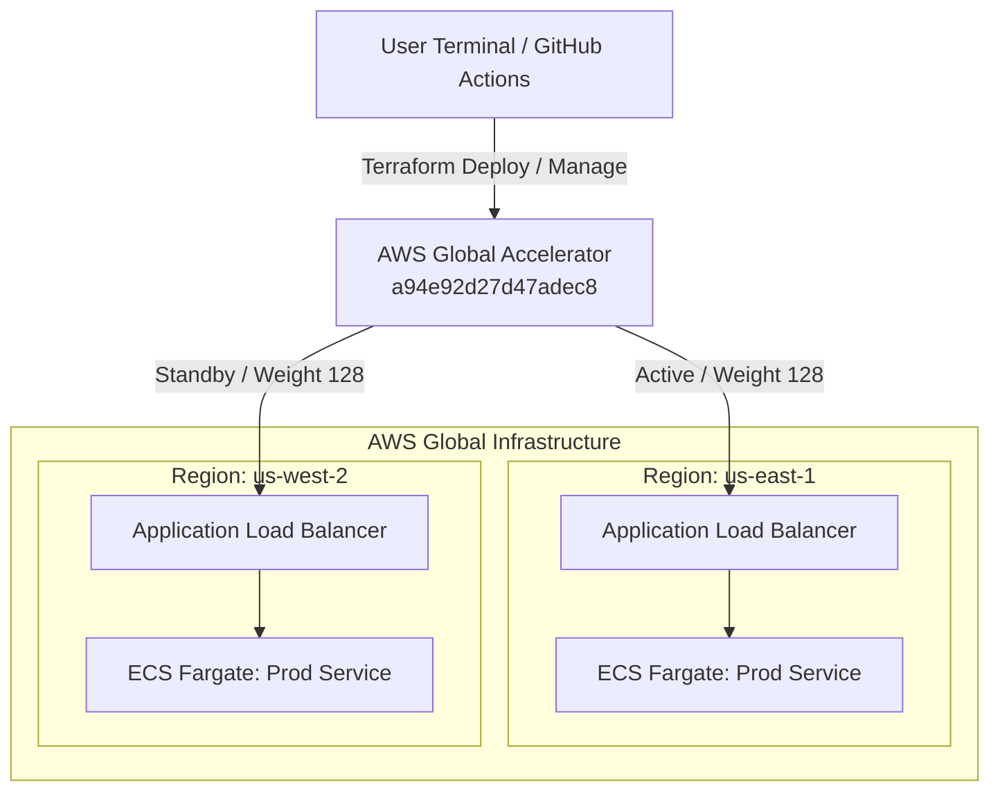
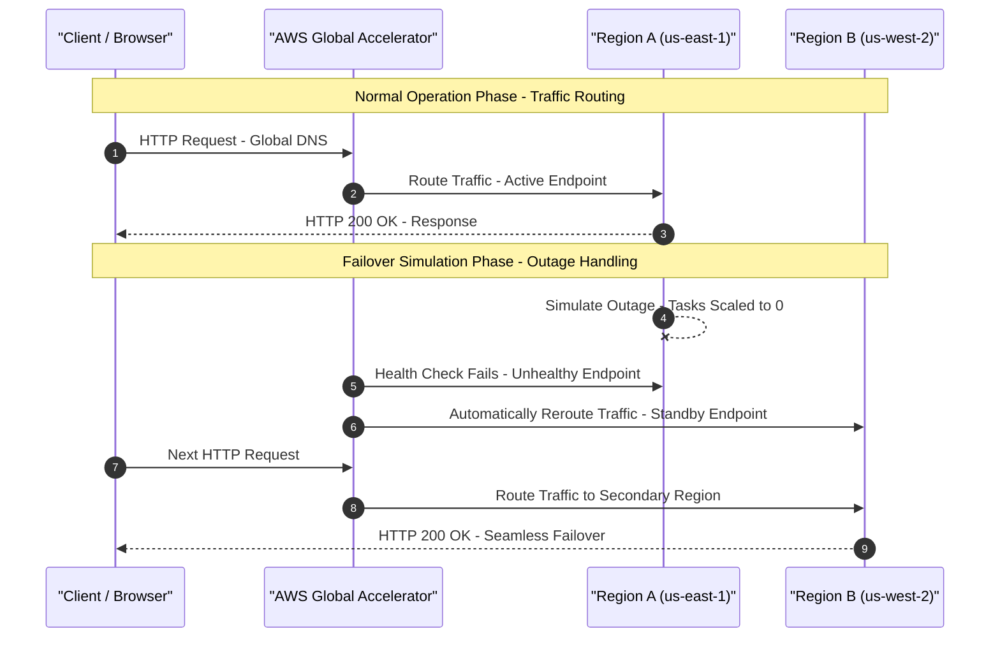

# Multi-Region AWS Infrastructure with Global Accelerator & ECS

A production-grade, highly resilient multi-region infrastructure project designed for seamless failover. This project provisions a modular environment using Terraform with an S3 backend and GitHub Actions, deploying an Amazon ECS Fargate application across two AWS regions (`us-east-1` and `us-west-2`) fronted by an AWS Global Accelerator.

---

## 🏗️ System Architecture

The blueprint below represents the multi-region entry point and traffic routing distribution across your infrastructure.

## 🔄 Traffic Routing & Failover

The sequence below illustrates normal traffic flow through AWS Global Accelerator and the automatic regional failover process.

